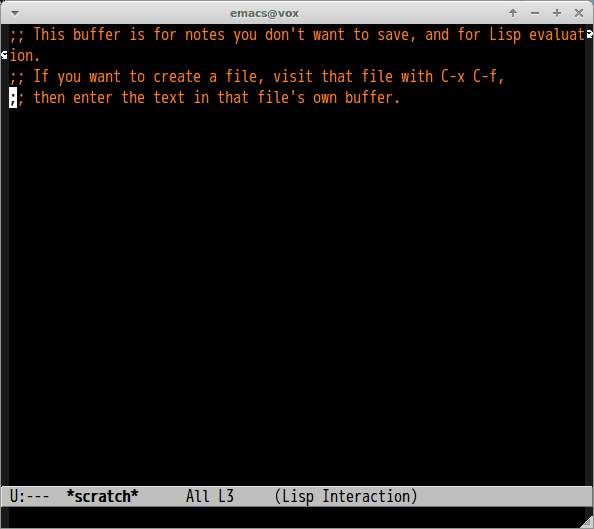

# helm-japanese-weather.el

Japanese weather information by [livedoor weather service](http://weather.livedoor.com/weather_hacks/webservice) with helm interface.

## Screencast

## Command

#### `M-x helm-japanese-weather`

Show weather report
